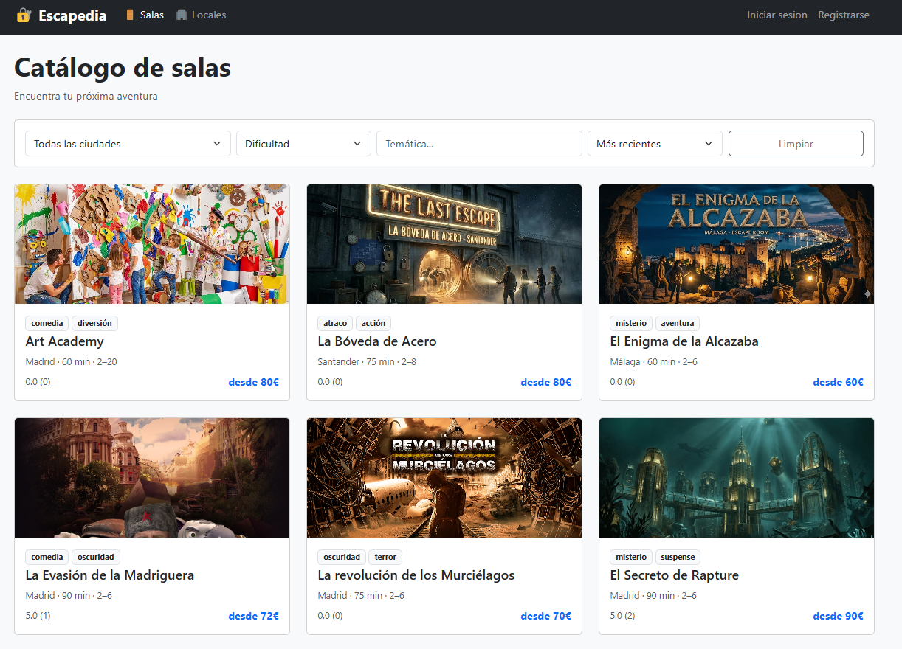
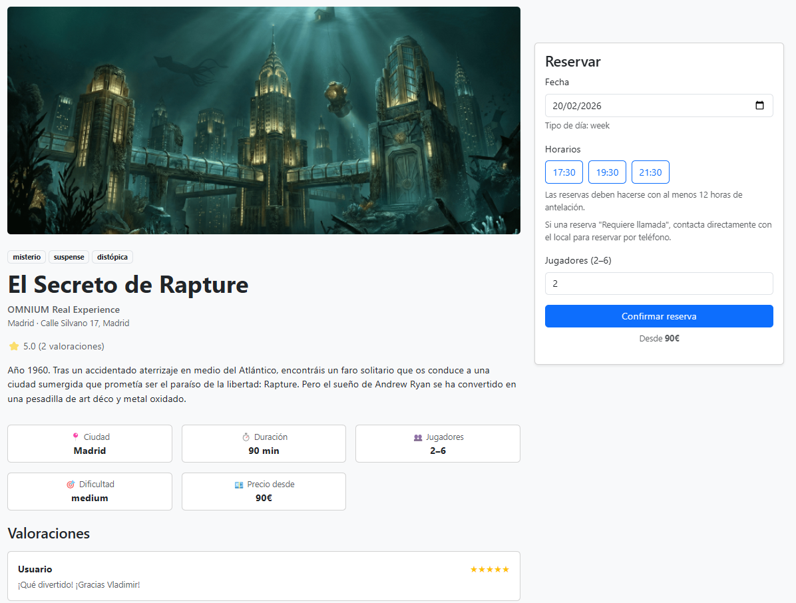
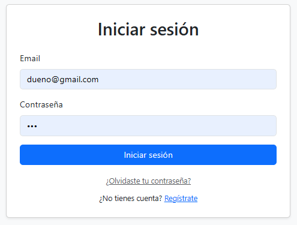
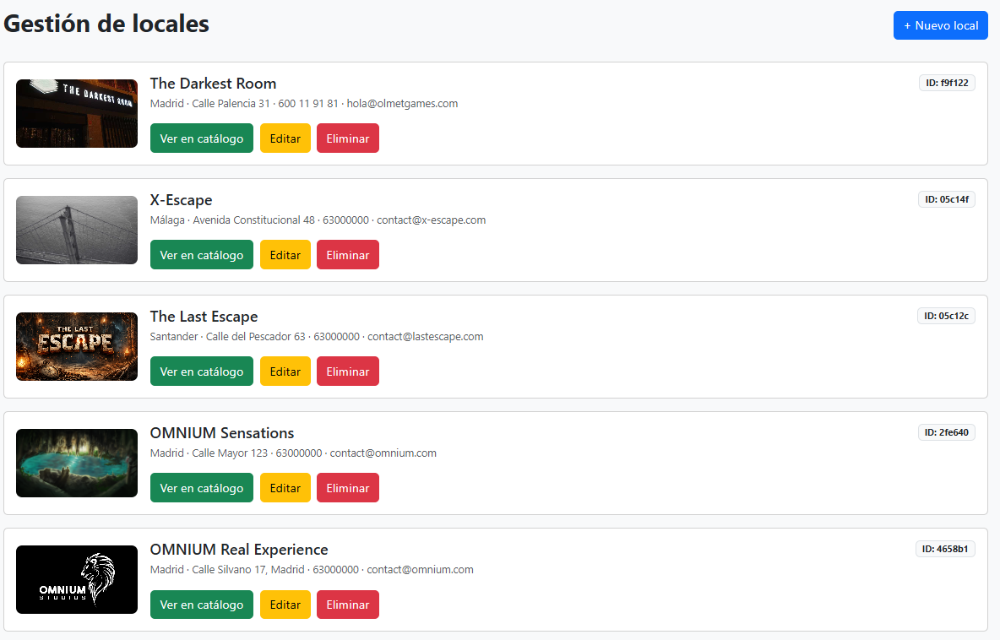
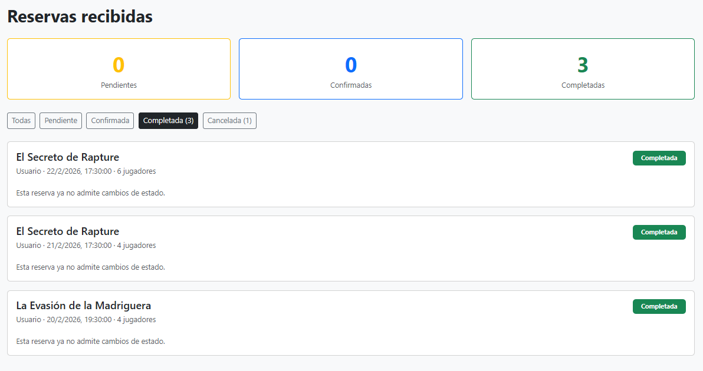
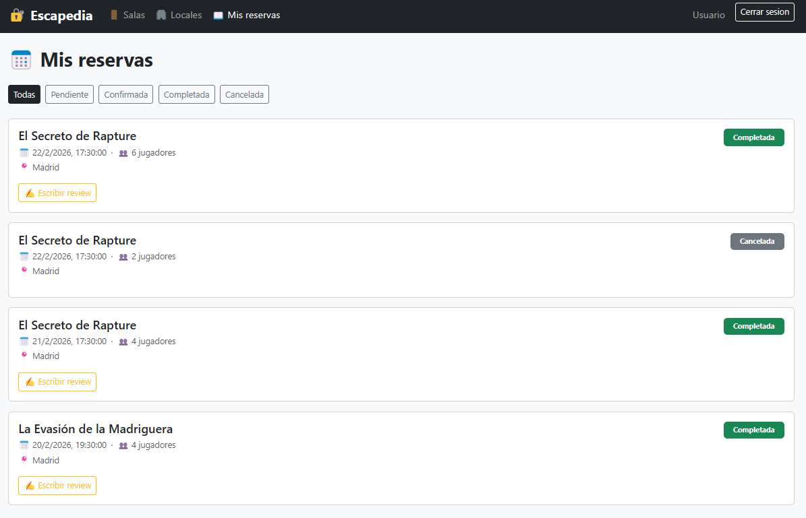
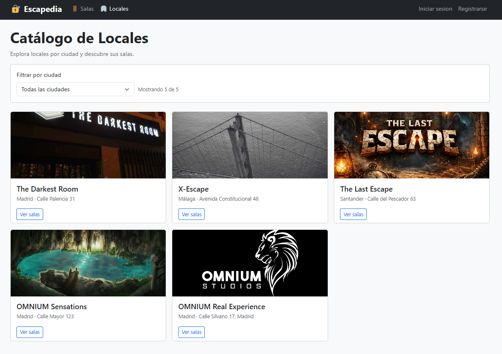

# 🎭 Escapedia MVP -- Frontend (Client)

> Proyecto académico desarrollado para el ejercicio **Full-Stack Product
> MVP (DAM 2º)**

Este repositorio contiene el **Frontend en React** del proyecto
Escapedia, la interfaz web que consume la API REST para explorar,
reservar y valorar Escape Rooms.

[](https://react.dev/)
[](https://vitejs.dev/)
[](https://axios-http.com/)
[](https://jwt.io/)

------------------------------------------------------------------------

## 🎬 Demo del proyecto

📺 **Vídeo demostrativo completo:**

[](https://www.youtube.com/watch?v=ID_VIDEO)

---


## 🖥️ Capturas de pantalla

### 🏠 Página principal (Catálogo de salas)
Vista pública con filtros dinámicos, paginación y ordenación.



---

### 🎭 Detalle de sala
Información completa de la Escape Room con galería de imágenes y opción de reserva.



---

### 🔐 Autenticación
Pantalla de inicio de sesión con validación y persistencia de JWT.



---

### 🏢 Gestión de Locales (Owner)
Panel para creación y edición de locales con subida de imagen y control de permisos.



---

### 🎭 Gestión de Salas (Owner)
Formulario de creación y edición de salas con integración de subida de imágenes vía backend.


---

### 📅 Gestión de Reservas (Owner)
Panel donde el propietario confirma, completa o cancela reservas según workflow.



---

### 📅 Reservas del Usuario
Vista del usuario con listado de reservas y estado (pending, confirmed, completed, cancelled).



---

### 🌍 Listado de Locales
Vista pública de locales disponibles con filtrado por ciudad.




---


## 📋 Tabla de contenidos

-   [Objetivo académico](#1-objetivo-académico)
-   [Stack tecnológico](#2-stack-tecnológico)
-   [Arquitectura del proyecto](#3-arquitectura-del-proyecto)
-   [Sistema de autenticación](#4-sistema-de-autenticación)
-   [Roles y control de acceso](#5-roles-y-control-de-acceso)
-   [Catálogo y filtros](#6-catálogo-y-filtros)
-   [Workflow de reservas](#7-workflow-de-reservas)
-   [Gestión de imágenes](#8-gestión-de-imágenes)
-   [Integración con la API](#9-integración-con-la-api)
-   [Variables de entorno](#10-variables-de-entorno)
-   [Instalación](#11-instalación)
-   [Testing funcional](#12-testing-funcional)
-   [Conclusión](#13-conclusión-académica)

------------------------------------------------------------------------

## 1. Objetivo académico

Este frontend ha sido diseñado para complementar la API y cumplir los
requisitos del ejercicio:

-   API SPA desarrollada en React
-   Consumo de API REST con Axios
-   Autenticación JWT persistente
-   Protección de rutas según rol
-   Formularios completos de creación y edición
-   Subida de imágenes a través del backend
-   Gestión completa de reservas y reviews
-   Filtros dinámicos y paginación
-   UX coherente con el modelo de negocio

------------------------------------------------------------------------

## 2. Stack tecnológico

  Componente     Tecnología
  -------------- -----------------
  Framework      React 18
  Bundler        Vite
  Routing        React Router v6
  Cliente HTTP   Axios
  Gestión Auth   Context API
  Estilos        CSS + Bootstrap

------------------------------------------------------------------------

## 3. Arquitectura del proyecto

    client/
     ├── src/
     │   ├── pages/
     │   ├── components/
     │   ├── services/
     │   ├── context/
     │   ├── App.jsx
     │   └── main.jsx

------------------------------------------------------------------------

## 4. Sistema de autenticación

-   Token almacenado en localStorage
-   Axios interceptor que añade Authorization: Bearer
-   Context global AuthContext
-   Persistencia de sesión tras refresco

### Recuperación de contraseña

-   Formulario /forgot-password
-   Email con token
-   Redirección a /reset-password?token=...
-   Cambio de contraseña validado por backend

------------------------------------------------------------------------

## 5. Roles y control de acceso

  Rol     Acceso
  ------- ----------------------------
  user    Reservas y reviews
  owner   Gestión de locales y salas
  admin   Acceso completo

Rutas privadas protegidas mediante validación de rol y autenticación.

------------------------------------------------------------------------

## 6. Catálogo y filtros

Implementado en HomePage:

-   Paginación
-   Filtro por ciudad (select dinámico)
-   Filtro por dificultad
-   Filtro por tema
-   Filtro por precio
-   Ordenación múltiple

Sincronizado con parámetros de query del backend.

------------------------------------------------------------------------

## 7. Workflow de reservas

    Usuario crea reserva → pending
    Owner confirma → confirmed
    Owner completa → completed
    Usuario crea review

UI adaptada al estado de la reserva.

------------------------------------------------------------------------

## 8. Gestión de imágenes

-   Conversión a base64 en cliente
-   Envío al backend
-   Cloudinary gestionado desde API
-   Replace y delete real en locales
-   Galería dinámica en salas

------------------------------------------------------------------------

## 9. Integración con la API

Endpoints principales consumidos:

-   /auth/\*
-   /rooms
-   /locales
-   /bookings
-   /reviews

Configuración centralizada en Axios con baseURL configurable.

------------------------------------------------------------------------

## 10. Variables de entorno

Crear archivo `.env`:

    VITE_API_URL=http://localhost:3000

------------------------------------------------------------------------

## 11. Instalación

``` bash
git clone https://github.com/DavidLamasCEV/escapedia-mvp-client.git
cd escapedia-mvp-client
npm install
npm run dev
```

Aplicación disponible en:

    http://localhost:5173

------------------------------------------------------------------------

## 12. Testing funcional

-   Registro y login
-   Persistencia de sesión
-   Reset de contraseña
-   Creación y edición de salas
-   Subida de imágenes
-   Flujo completo de reservas
-   Reviews condicionadas
-   Protección por roles
-   Filtros y paginación

------------------------------------------------------------------------

## 13. Conclusión académica

El frontend se encuentra completamente alineado con el backend y cumple
los requisitos del ejercicio Full-Stack Product MVP.

------------------------------------------------------------------------

**Autor:** DavidLamasCEV\
**Última actualización:** Febrero 2026
